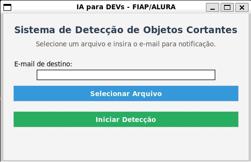

# 🔍 Sistema de Detecção de Objetos Cortantes com YOLOv5 e Tkinter

Este projeto usa **YOLOv5** para detectar objetos cortantes em imagens ou vídeos. Ao detectar algo, o sistema envia um e-mail com os frames identificados.

---

## 🧰 Tecnologias Utilizadas

- [Python 3.8+](https://www.python.org/)
- [YOLOv5 (Ultralytics)](https://github.com/ultralytics/yolov5)
- OpenCV
- Tkinter
- Torch (PyTorch)
- SMTP (para envio de e-mails)

---

## 🚀 Instalação e Execução

### 1. Clone o repositório

```bash
git clone https://github.com/seu-usuario/projeto-yolov5-gui.git
cd projeto-yolov5-gui
```

### 2. (Recomendado) Crie e ative um ambiente virtual

```bash
python -m venv venv
# Windows
venv\Scripts\activate
# macOS/Linux
source venv/bin/activate
```

### 3. Instale as dependências

```bash
pip install -r requirements.txt
```

> ⚠️ O `torch` pode ser instalado com suporte a GPU, se desejar:
> Consulte https://pytorch.org/get-started/locally/

---

## 📁 Arquivos Esperados

Coloque seu modelo YOLOv5 treinado com nome `best.pt` na raiz do projeto:

```
projeto-yolov5-gui/
├── main.py
├── best.pt  ✅
├── requirements.txt
```

---

## ✉️ Configuração do E-mail (Gmail)

1. Acesse: [https://myaccount.google.com/apppasswords](https://myaccount.google.com/apppasswords)
2. Gere uma senha de app para "Correio" ou "E-mail"
3. No seu código `main.py`, edite:

```python
email_user = "seuemail@gmail.com"
email_cod = "SENHA_DO_APP"
```

---

## ▶️ Como Usar

1. Execute o programa:

```bash
python main.py
```

2. Na interface:
   - Digite um e-mail de destino
   - Selecione uma **imagem** ou **vídeo**
   - Clique em "Iniciar Detecção"
   - Se houver detecção, o sistema envia os resultados por e-mail

---

## ✅ Formatos Suportados

- **Imagens:** `.jpg`, `.jpeg`, `.png`, `.bmp`
- **Vídeos:** `.mp4`, `.avi`, `.mov`, `.mkv`

---

## 📦 Estrutura de Pastas

```
frames_detectados/   # Armazena os frames/imagens com detecção
best.pt              # Seu modelo treinado YOLOv5
main.py              # Código principal com GUI
requirements.txt     # Dependências
```

---

## 🛠 Possíveis Melhorias

- Suporte a múltiplos arquivos de entrada
- Integração com banco de dados/logs
- Escolha de parâmetros como `conf`, `iou` via interface
- Compatibilidade com diferentes provedores de e-mail

---

## 📸 Prévia da Interface



---

## 📄 Licença

Este projeto é de livre uso para fins acadêmicos ou pessoais. Sinta-se à vontade para modificar.
